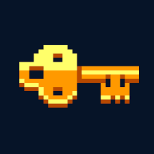

<div>
    <h1 align='center'>
        <br>
          
        <br>
        <br>
            
        <br>
    </h1>
</div>


Currently Key-Bot supports the following commands:  
- Trivia 
    - Allows the user to answer true or false or multiple choice commands within a set interval.
- Poll
    - User can create a poll that will last for however many minutes the user specifies with a maximum of four options.
- Reddit
    - Posts a random post from a specified SubReddit or from r/meme if not specified.
- Profile
    - Shows a user's canvas profile card which displays their XP and level on the server.
- EditProfile
    - Allows user to change the font and banner on their KeyBot profile card or the SteamURL option in their stats card.
- Stats
    - Shows a user's Trivia statistics (i.e. how many Trivia questions in each category they answered correctly)

    


# Installation
Installation is as simple as cloning the Github repository.  
First, simply clone the repo into your desired folder and cd into keybot-main.  
```bash
git clone https://github.com/mannygregory/KeyBot-Backend.git
cd keybot-main
```
Second, run the following command to install the build dependencies  
```bash
npm install
```
Third, setup your system variables, by either editing your path variables or by env file.  
KeyBot will require you to have the following variables  
1. BOT_TOKEN
2. CLIENT_ID
3. GUILD_ID
4. MONGO_ID
<!-- -->
Finally, you can run D-bot by running the following command in the root folder
```bash
npm run
```
and if you wish to deploy your newly added commands run the following command in the root folder
```bash
npm run deploy
```

